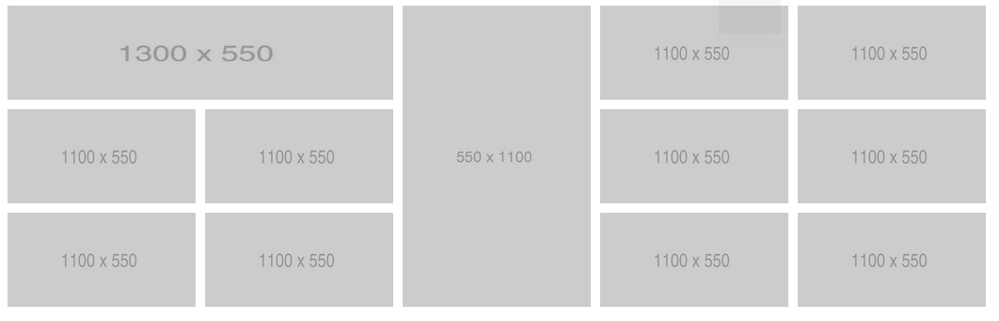
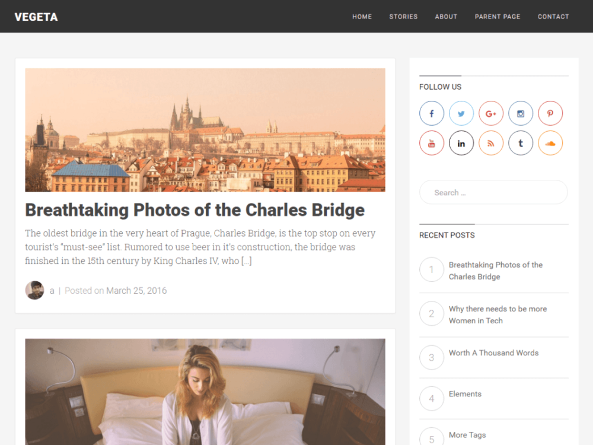

# Домашнее задание

1. Пройти игру [Grid Garden](https://cssgridgarden.com/#ru).

2. В файле `answers.html` ответь на некоторые вопросы. Формат будет такой:

```html
<!-- Каждый ответ на вопрос будет в div.pair -->
<div class="pair eight-lesson">
    <p class="question">Что такое осень?</p>
    <p class="answer">Это небо.</p>
</div>
``` 

Копировать и вставлять готовые ответы нельзя. Теорию читать можно и нужно. В файле `Additional.md` я дал ссылки на некоторые хорошие источники, обрати на них внимание.

## Вопросы

1. Чем отличается абсолютное позиционирование от относительного?
2. Что такое трек сетки в CSS Grid?
3. Для чего используются свойства `grid-area` и `grid-template-area`?
4. В чем отличие свойств `justify-content`, `justify-items` и `justify-self`?
5. Что такое единица _fr_?
6. Зачем используются и как работают grid-column/grid-row?

3. Создай папку eight-lesson, а в ней файлы __grid-gallery.html__ и __grid-gallery.css__. Повтори максимально точно галлерею, как в примере ниже:



## Дополнительные требования:

* Нельзя использовать никаких систем построения сеток кроме CSS Grid;
* Каждый элемент кликабельный, при клике -- картинка открывается браузером;
* Тут удобно будет использовать псевдокласс `:nht-child`;
* Попробуй использовать `object-fit: cover`;
* Так же удобно будет использовать сервис `http://via.placeholder.com/1200x250`, где 1200 -- ширина, а 250 -- высота картинки.

4. Создай файлы __blog.html__ и __blog.css__. Используя полученные знания по CSS Grid и Flexbox, попробуй как можно точнее повторить элементы, которые видишь в примере ниже:



## Обязательные требования:

* Не стоит пытаться добиться фотографической точности, но результат должен быть максимально похожим на пример;
* Картинка поста, заголовок поста, аватар автора, все кнопки в блоке __Follow Us__, заголовки в блоке __Recent Posts__ должны быть кликабельными;
* Форма поиска должна быть выполнена именно в виде формы;   
* Старайся побольше использовать CSS Grid, чтобы оценить, где он удобен, а где тебе будет легче работать с Flexbox;
* Для добавления иконок социальных сетей используется иконочный шрифт [Font Awesome](https://fontawesome.com/);
* Используй требования по HTML и CSS, которые есть в твоем репозитории.

## Дополнительные требования:

* Страница не должна быть адаптивной, но если очень хочется, то можешь подогнать ее и под мобильные устройства;
* Цифры в блоке Recent Post, при создании нового элемента, должны увеличиваться без вмешательства верстальщика.

---

#### Расчетное время выполнения: 8 - 15 часов.