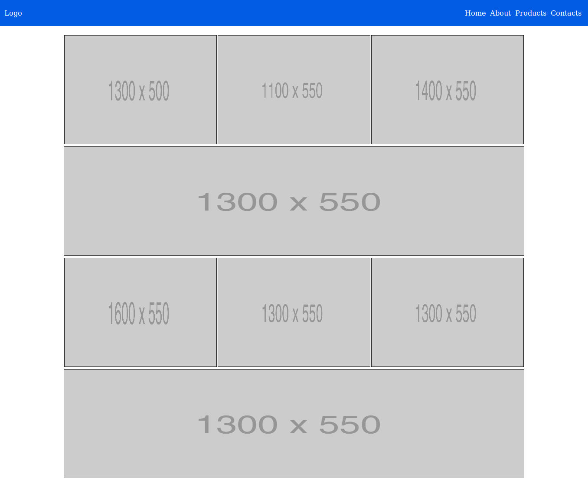

# Домашнее задание

1. В файле `answers.html` ответь на некоторые вопросы. Формат будет такой:

```html
<!-- Каждый ответ на вопрос будет в div.pair -->
<div class="pair seventh-lesson">
    <p class="question">Что такое осень?</p>
    <p class="answer">Это небо.</p>
</div>
``` 

Копировать и вставлять готовые ответы нельзя. Теорию читать можно и нужно. В файле `Additional.md` я дал ссылки на некоторые хорошие источники, обрати на них внимание.

## Вопросы

1. За что отвечает свойство `display`?
2. Чем отличается `width: 100%` от `width: auto`?
3. Зачем нужно свойство `box-sizing`?
4. Чем отличаются свойства `justify-content` и `align-items`?
5. Как заставить флексовые элементы переноситься на новую строку?
6. Назови два способа выравнивания: 1) блочного элемента по центру; 2) строчного элемента по центру.

2. Создай папку seventh-lesson, а в ней файл __flexbox-gallery.html__ и __style.css__. Повтори максимально точно хедер и галлерею, как в примере ниже:



## Дополнительные требования:

* Нельзя использовать никаких систем построения сеток кроме Flexbox;
* Каждый элемент кликабельный, при клике -- картинка открывается браузером;
* Тут удобно будет использовать псевдокласс `:nht-child`;
* Так же удобно будет использовать сервис `http://via.placeholder.com/1200x250`, где 1200 -- ширина, а 250 -- высота картинки.

---

#### Расчетное время выполнения: 1 - 4 часа.